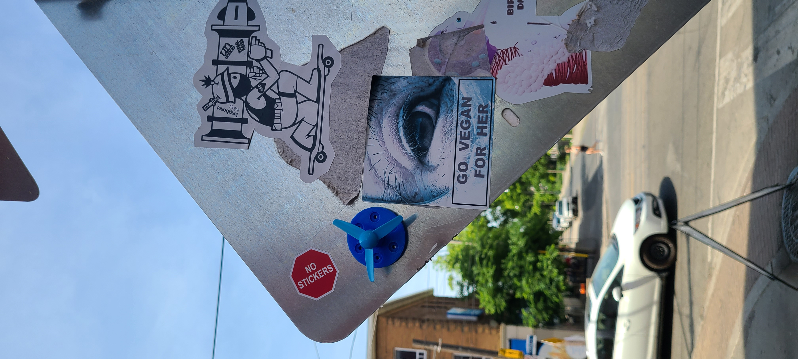
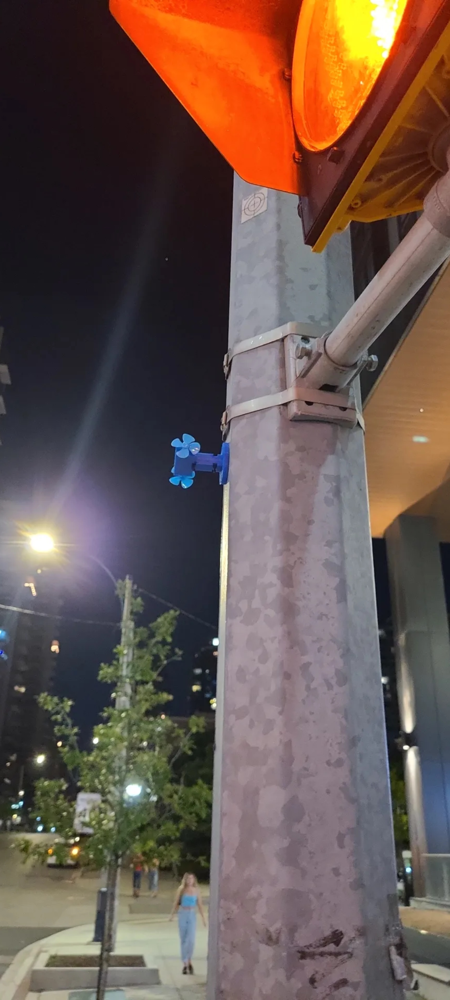

# ferfereh

Ferfereh is a [3d-printed piece](./3d/gen6-c4.stl) of graffiti with an auto-generated map: [geojson](./coords.geojson), [qgiscloud.com](https://qgiscloud.com/kamangir/ferfereh-published).

| [](https://github.com/kamangir/ferfereh/blob/main/3d/gen5.stl) | [](https://github.com/kamangir/ferfereh/blob/main/3d/gen6-c4.stl) | [](https://github.com/kamangir/ferfereh/blob/main/3d/gen6-s4.stl) |
|---|---|---| 

```bash
# mac
ferfereh help
ferfereh publish 3d-files
ferfereh publish coords
```
