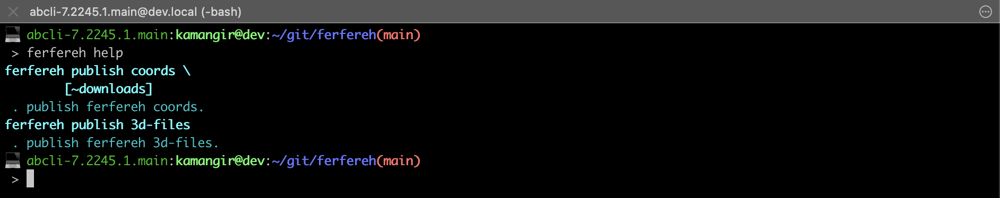

# ferfereh

Ferfereh is a 3d-printed piece of graffiti with an auto-generated [map](./coords.geojson).

|  |  |  |  |
|---|---|---|---|

# gen5

- [gen5.stl](3d/gen5.stl)

# gen6

- [gen6-c4](3d/gen6-c4.stl)
- [gen6-d32](3d/gen6-d32.stl)
- [gen6-s4](3d/gen6-s4.stl)

# gen7

- [gen7-2](3d/gen7-2.stl)
