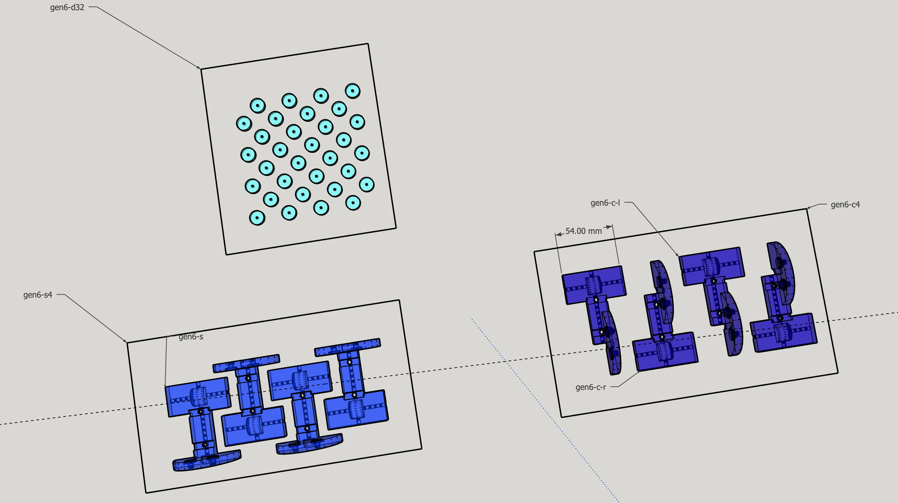
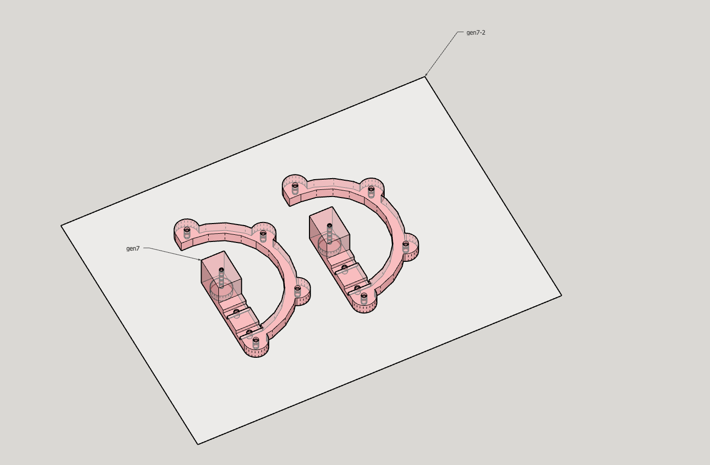

# ferfereh

Ferfereh is a 3d-printed piece of graffiti with an auto-generated [map](./coords.geojson).

|  |  |  |  |
|---|---|---|---|

# brackets

## gen5

- [gen5.stl](3d/gen5.stl)

## gen6

- [gen6-c4](3d/gen6-c4.stl)
- [gen6-d32](3d/gen6-d32.stl)
- [gen6-s4](3d/gen6-s4.stl)

## gen7

- [gen7-2](3d/gen7-2.stl)

# tools & materials

1. 2 mm solid brass rods.
1. aviation snips.
1. (multiple) bags to carry the brackets, tools, and other materials to site.
1. cutting nippers.
1. mini pliers.
1. propeller fan.
1. double-sided, outdoor, water-resistant, mounting tape.
1. multi bit electronics screwdriver.
1. precision craft knife w/ spare blades
1. small hammer.

|  |  |   | 
|---|---|---|
|  |   |   | 
|  |   |   | 
|  | | |  
