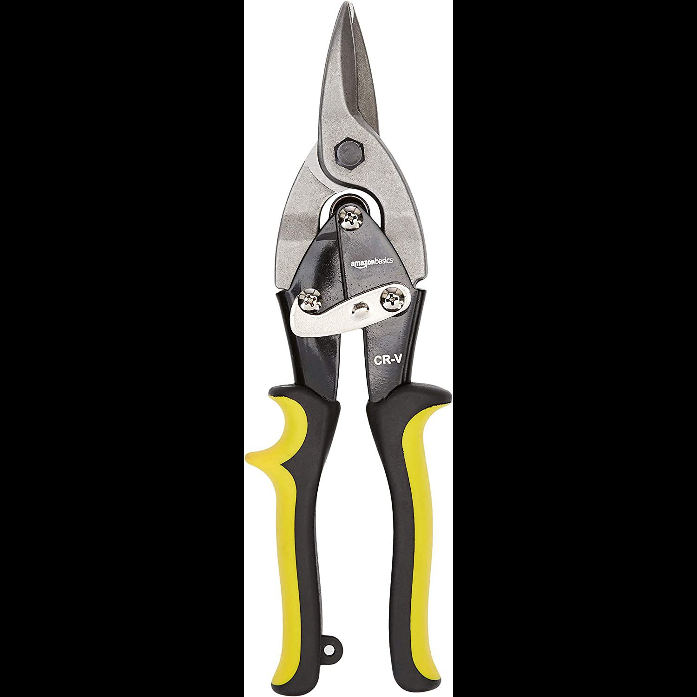
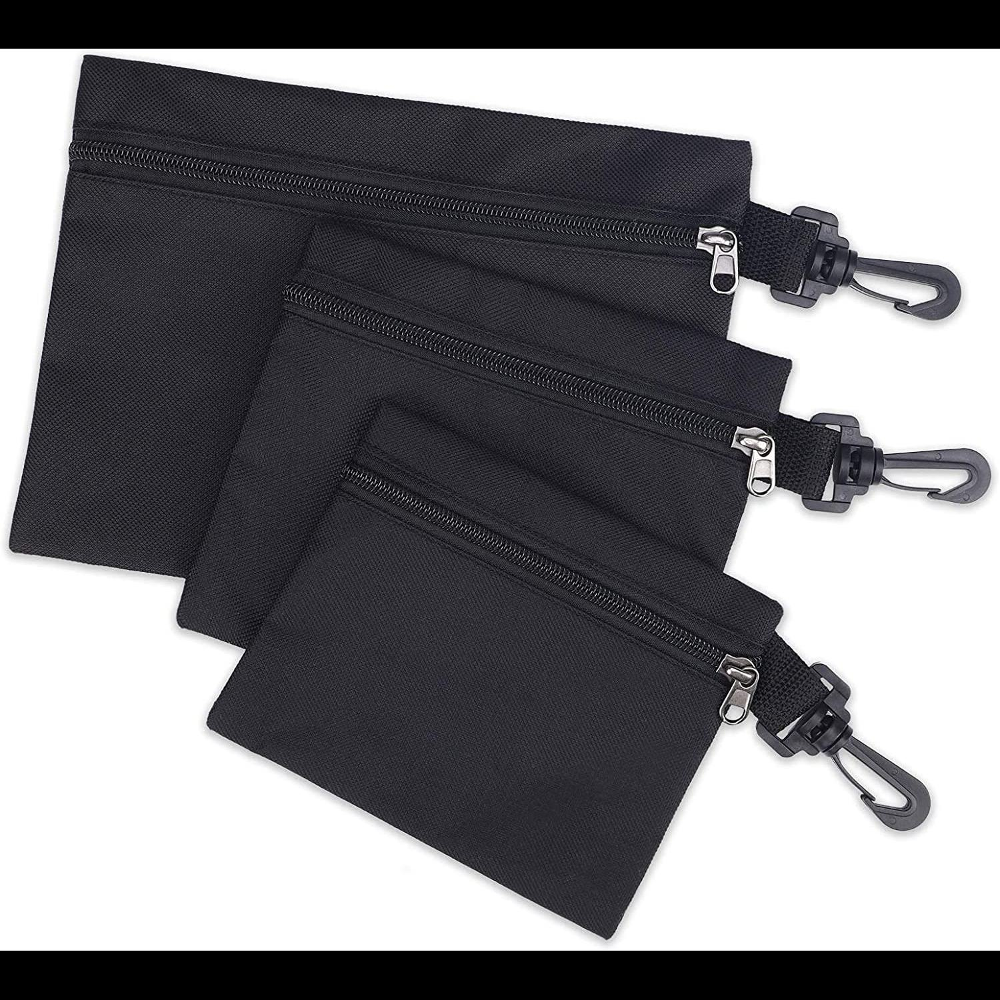
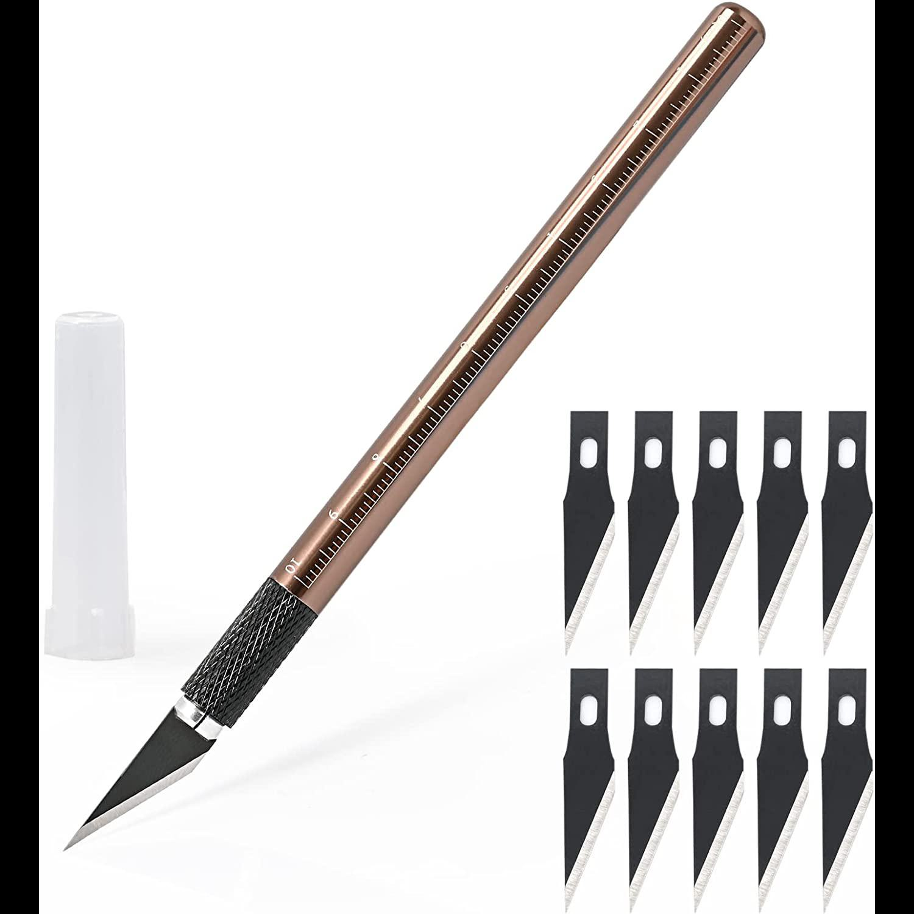
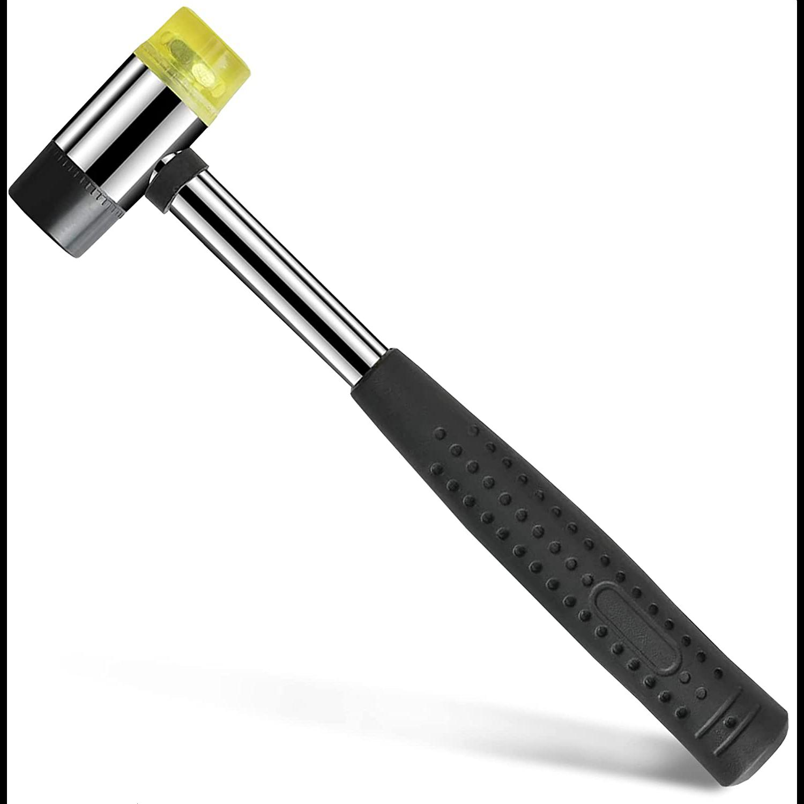

# ferfereh

Ferfereh is a 3d-printed piece of graffiti with a cloud-generated [map](./coords.geojson).

```bash
> ferfereh help
ferfereh-1.79.1: 3d-printed graffiti.

ferfereh cleanup
 . cleanup ferfereh.
ferfereh publish coords \
	[~downloads]
 . publish ferfereh coords.
ferfereh publish 3d-files
 . publish ferfereh 3d-files.
 ```


| [](#gen5) | [](#gen6) | [](#gen6) | [](#gen7) |
|---|---|---|---|


# brackets

## gen5


- [gen5.stl](3d/gen5.stl)

## gen6


- [gen6-c4](3d/gen6-c4.stl)
- [gen6-d32](3d/gen6-d32.stl)
- [gen6-s4](3d/gen6-s4.stl)

## gen7


- [gen7-2](3d/gen7-2.stl)

# tools & materials

1. 2 mm solid brass rods.
1. aviation snips.
1. (multiple) bags to carry the brackets, tools, and other materials to site.
1. cutting nippers.
1. mini pliers.
1. propeller fan.
1. double-sided, outdoor, water-resistant, mounting tape.
1. multi bit electronics screwdriver.
1. precision craft knife w/ spare blades
1. small hammer.

|  |  |   | 
|---|---|---|
|  |   |   | 
|  |   |   | 
|  | | |  
