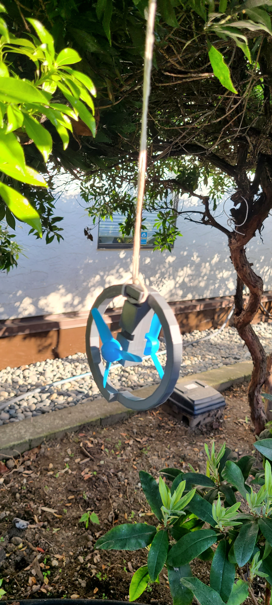

# ferfereh

Ferfereh is a [3d-printed piece](./3d/gen6-c4.stl) of graffiti with an auto-generated [map](./coords.geojson).

|  |  |  |  |
|---|---|---|---|

# gen5

- [gen5.stl](../3d/gen5.stl)

# gen6-c2

# gen6-s

# gen7-2
