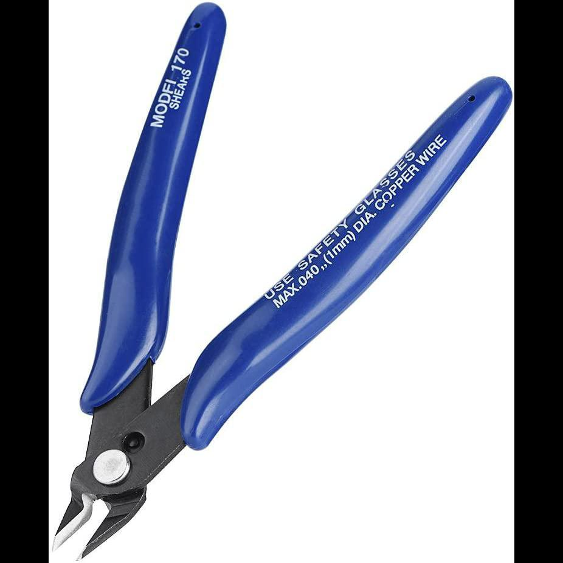
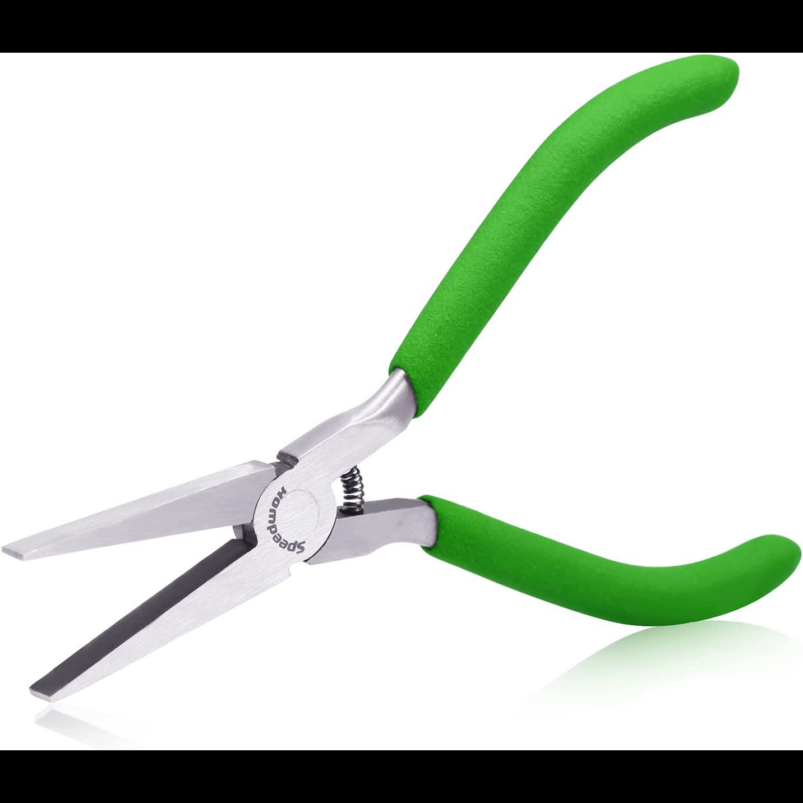
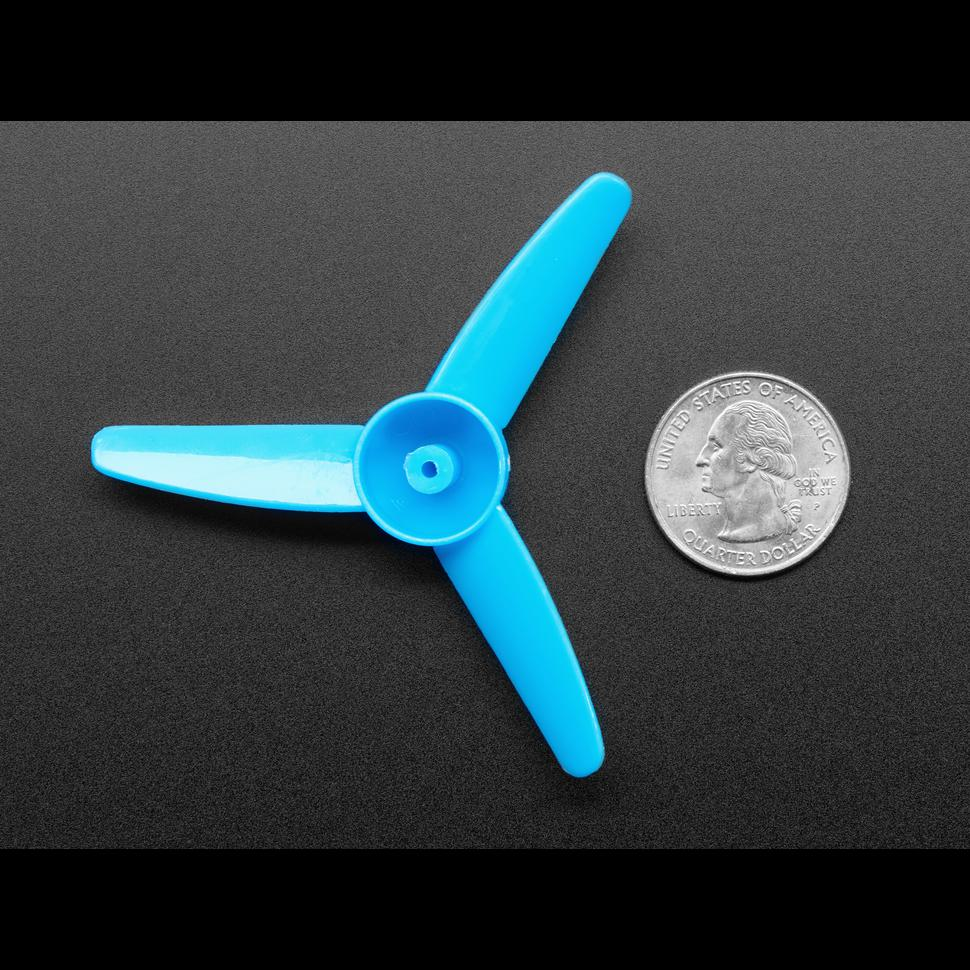
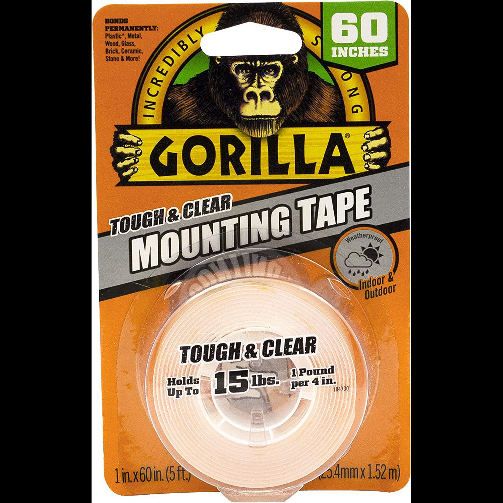
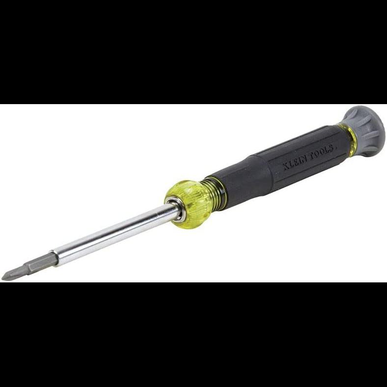
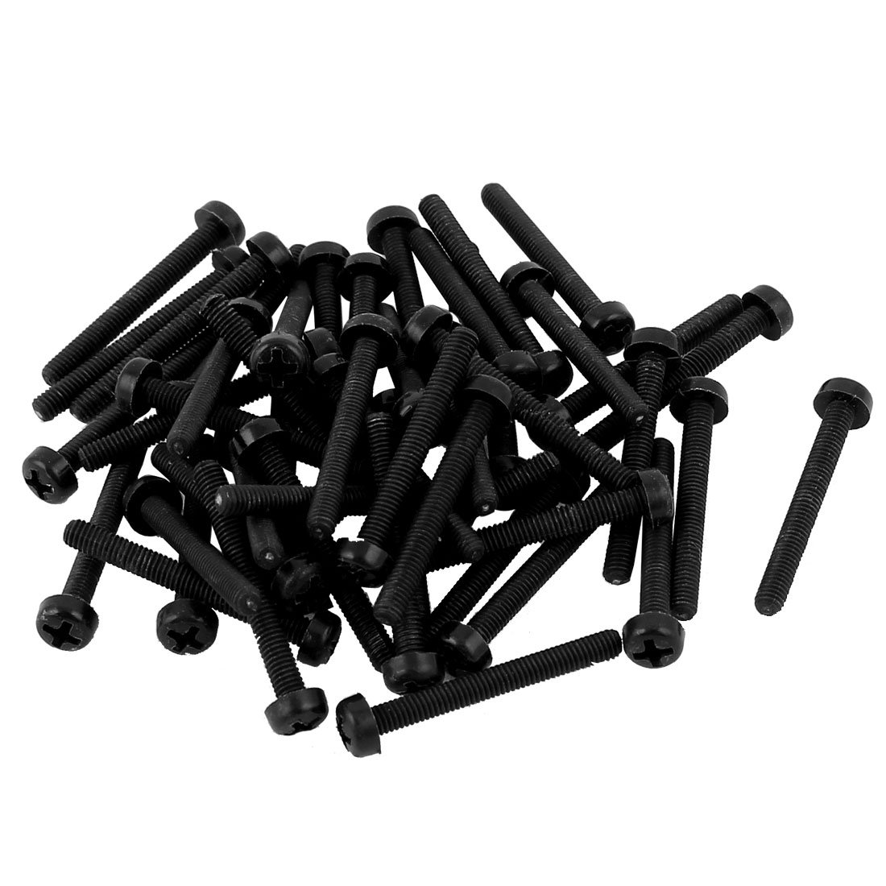

# 🌀 ferfereh

🌀 `ferfereh` is a 3d-printed piece of graffiti with a cloud-generated [map](./coords.geojson).

```bash
pip install blue-plugin
```

```bash
 > ferfereh help
ferfereh cleanup
 . cleanup ferfereh.
ferfereh exif get \
	[-] \
	<filename.jpg>
 . get exif.
ferfereh exif install
 . install exif.
ferfereh exif put \
	[~backup,dryrun,lat=<lat>,lon=<lon>,validate] \
	<filename.jpg>
 . put exif.
ferfereh publish coords \
	[~downloads]
 . publish ferfereh coords.
ferfereh publish 3d-files
 . publish ferfereh 3d-files.
```

| [](#gen5) | [](#gen6) | [](#gen6) | [](#gen7) |
| ------------------------------------ | --------------------------------------- | -------------------------------------- | -------------------------------------- |

# brackets

## gen5


- [gen5.stl](./3d/gen5.stl)

## gen6


- [gen6-c4](./3d/gen6-c4.stl)
- [gen6-d32](./3d/gen6-d32.stl)
- [gen6-s4](./3d/gen6-s4.stl)

## gen7


- [gen7-2](./3d/gen7-2.stl)

# tools & materials

| item                                                                      | image                                                           | examples                                                                           |
| ------------------------------------------------------------------------- | --------------------------------------------------------------- | ---------------------------------------------------------------------------------- |
| 2 mm solid brass rods                                                     |                   | https://www.amazon.ca/gp/product/B089LDXN22                                        |
| aviation snips                                                            |                     |                                                                                    |
| (multiple) bags to carry the brackets, tools, and other materials to site |                               |                                                                                    |
| cutting nippers                                                           |                    |                                                                                    |
| mini pliers                                                               |                        |                                                                                    |
| propeller fan                                                             |                         | https://www.adafruit.com/product/3896, https://www.amazon.ca/gp/product/B091TBQ7CK |
| double-sided, outdoor, water-resistant, mounting tape                     |                      |                                                                                    |
| multi bit electronics screwdriver                                         |  |                                                                                    |
| precision craft knife w/ spare blade                                      |              |                                                                                    |
| small hammer                                                              |                       |                                                                                    |
| M3 Nylon Machine Screws                                                   |                              | https://www.amazon.ca/gp/product/B012TACIBC                                        |

---

[](https://pypi.org/project/ferfereh/)
